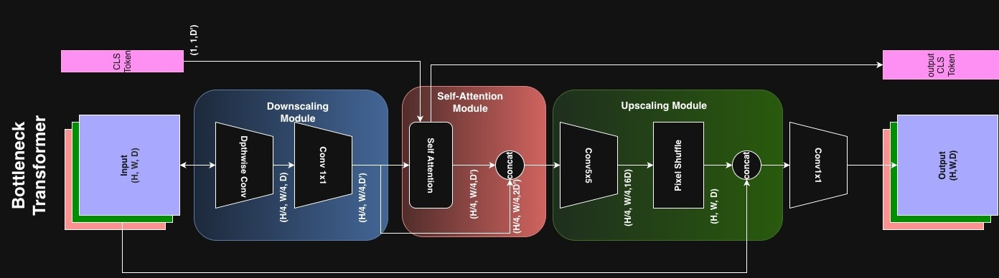

# CNNFormers
This is an official Repository for CNNFormers, an architecture heavily inspired by [Convolutional Vision Transformers (CvT)](https://arxiv.org/abs/2103.15808) and [Convolution Enhanced Image Transformers](https://arxiv.org/abs/2103.11816).

# Architecture
The architecture was designed with focus on high resolution dense prediction as priority with self-attention helping in global information flow at every step.
Most prior work on hybrid architectures things in 'token-first, image-second' terms. Thus making transformer modules their basic processing blocks and paradigms. In this work, we slightly shift the paradigm to 'image-first, token-second'. Thus, the ResNet-18 blocks become our main processing block. This paradigm helps us to think of attention tokens as 'images-first' thus standard downscaling, upscaling and bottle-necking techniques become applicable.

We introduce a BottleNeck MHSA and integrate it after every stage in the ResNet18 architecture.

  

BottleNeck MHSA is a lightweight multi-head attention block block that bottlenecks the input 2D features both spatially as well as dimensionally. The idea is to be able **learn** to 'restore' downscaled features back to their original resolution.

# Training
We train our mdoel using dense self supervised learning. We use a constrastive loss between the last k layers  to enforce pixel consistency between the 2 views of the input image. We also add a gloabl contrastive loss that contrasts on global image embeddings intra-batch.

# Data
The data used is a downsampled version of Imagenet-1k. We use DINOv2 to create gloabl embeddings of all the images in imagenet-1k. We cluster the dataset using Agglomerative clustering into 512 clusters per class. We then randomly sample 1 image from each of these clusters thus maininaining uniform diversity, and capturing the class-wise long-tail images.

# Experiments
We are currently in the middle of training this architecture. The unavailability of funded GPUs has stalled slowed down the overall progress, but we hope to finish 200K steps (16 epochs) by the end of this month.

# Results
Currently, after Pre-Training for 119 k steps at batch size: 40, (~8 epochs on the Imagenet-1k subset), we have achieved ~10.42% validation accuracy on the complete imagenet-1k validation set using only K-Nearest neighbors on the output backbone embeddings.

## Significance
On Imagenet-1k, on random guess, any image has a 0.1% chance of being classified correctly (1 in a 1000 classes), thus the baseline accuracy on the dataset is 0.1%, but we achieve 10.42% (>100 times) the expectation on a training set which is only ~40% the size of the original and only in ~8 epochs.
This makes current result at least promising enough for further investigation.